---
# ORACLE PTS AppDev Cloud-Native DevOps workshop #
-----
## Deploy Tomcat based application to Application Container Cloud Service ##

### About this tutorial ###
Oracle Application Container Cloud Service includes Oracle Java SE Cloud Service and Oracle Node Cloud Service. It provides a lightweight infrastructure so that you can run Java SE 7, Java SE 8, and Node.js applications in the Oracle Cloud.

This tutorial demonstrates how to

+ package your existing Tomcat (Java SE) based solution to Application Container Cloud Service
+ deploy application to Application Container Cloud Service

### Prerequisites ###

- Oracle Cloud Services account including Application Cloud Container Service.

- Your computer’s environment must be configured prior to attempting the Hands-on-labs. Please follow the instruction in the linked documents [Windows](http://www.oracle.com/webfolder/technetwork/tutorials/OracleCode/Windows-HOL-setup.pdf) or [Mac](http://www.oracle.com/webfolder/technetwork/tutorials/OracleCode/Mac-HOL-setup.pdf)  prior to attempting the Labs.


### Steps ###

#### Deploy Tomcat Sample Application on-premise ####

Download Apache Tomcat 8.5.15 into a folder on your local machine, e.g. `/u01` or `C:\`

 Direct Link:

  [http://archive.apache.org/dist/tomcat/tomcat-8/v8.5.15/bin/apache-tomcat-8.5.15.tar.gz](http://archive.apache.org/dist/tomcat/tomcat-8/v8.5.15/bin/apache-tomcat-8.5.15.tar.gz).

 If the direct link doesn't work please find the right download location of the latest or desired version of Tomcat on [https://tomcat.apache.org/](https://tomcat.apache.org/).

````
[oracle@localhost Desktop]$ cd /u01
[oracle@localhost u01]$ wget http://archive.apache.org/dist/tomcat/tomcat-8/v8.5.15/bin/apache-tomcat-8.5.15.tar.gz
--2017-06-01 17:02:11--  http://archive.apache.org/dist/tomcat/tomcat-8/v8.5.15/bin/apache-tomcat-8.5.15.tar.gz
Resolving archive.apache.org... 163.172.17.199
Connecting to archive.apache.org|163.172.17.199|:80... connected.
HTTP request sent, awaiting response... 200 OK
Length: 9393241 (9.0M) [application/x-gzip]
Saving to: ‘apache-tomcat-8.5.15.tar.gz’

apache-tomcat-8.5.1 100%[===================>]   8.96M  3.45MB/s    in 2.6s

2017-06-01 17:02:14 (3.45 MB/s) - ‘apache-tomcat-8.5.15.tar.gz’ saved [9393241/9393241]

[oracle@localhost u01]$
````
Extract the archive into `/u01`:

````
[oracle@localhost u01]$ tar -zvxf apache-tomcat-8.5.15.tar.gz
apache-tomcat-8.5.15/conf/
apache-tomcat-8.5.15/conf/catalina.policy
apache-tomcat-8.5.15/conf/catalina.properties
apache-tomcat-8.5.15/conf/context.xml
...
...
...
apache-tomcat-8.5.15/bin/catalina.sh
apache-tomcat-8.5.15/bin/configtest.sh
apache-tomcat-8.5.15/bin/daemon.sh
apache-tomcat-8.5.15/bin/digest.sh
apache-tomcat-8.5.15/bin/setclasspath.sh
apache-tomcat-8.5.15/bin/shutdown.sh
apache-tomcat-8.5.15/bin/startup.sh
apache-tomcat-8.5.15/bin/tool-wrapper.sh
apache-tomcat-8.5.15/bin/version.sh
[oracle@localhost u01]$
````

Now start Tomcat server using its `startup.sh` script:

```
[oracle@localhost u01]$ apache-tomcat-8.5.15/bin/catalina.sh start
Using CATALINA_BASE:   /u01/apache-tomcat-8.5.15
Using CATALINA_HOME:   /u01/apache-tomcat-8.5.15
Using CATALINA_TMPDIR: /u01/apache-tomcat-8.5.15/temp
Using JRE_HOME:        /usr/java/latest
Using CLASSPATH:       /u01/apache-tomcat-8.5.15/bin/bootstrap.jar:/u01/apache-tomcat-8.5.15/bin/tomcat-juli.jar
Tomcat started.
[oracle@localhost u01]$
```
Open browser to check Tomcat is running. Hit http://localhost:8080/

Open a browser and hit the following URL: `http://localhost:8080`
You should now see the home page of Apache Tomcat server.
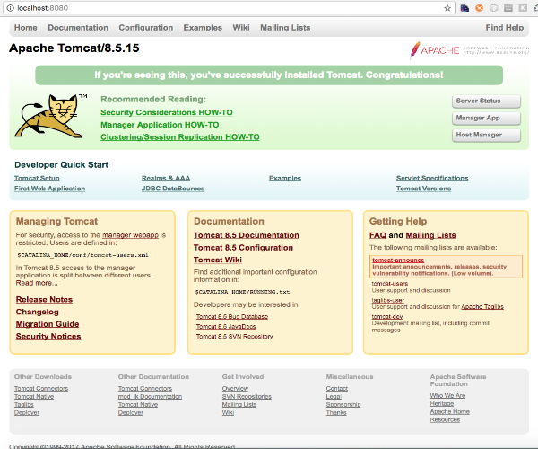

The next step is to build the sample SpringBoot application.

Copy the content from [springboot-sample](../springboot-sample/) to your local workspace.
```
[oracle@localhost u01]$ cp -R $GIT_REPO_LOCAL_CLONE/springboot-sample .
```
 Change the directory to `springboot-sample` and run `mvn install`.

	[oracle@localhost u01]$ cd /u01/content/cloud-native-devops-workshop/springboot-sample/
	[oracle@localhost springboot-sample]$ mvn install
	[INFO] Scanning for projects...
	Downloading: https://repo.maven.apache.org/maven2/org/springframework/boot/spring-boot-starter-parent/1.3.3.RELEASE/spring-boot-starter-parent-1.3.3.RELEASE.pom
	Downloaded: https://repo.maven.apache.org/maven2/org/springframework/boot/spring-boot-starter-parent/1.3.3.RELEASE/spring-boot-starter-parent-1.3.3.RELEASE.pom (7 KB at 11.3 KB/sec)
	...
	...
	...
	Downloaded: https://repo.maven.apache.org/maven2/org/apache/maven/shared/file-management/1.1/file-management-1.1.jar (31 KB at 13.7 KB/sec)
	[INFO] Reading assembly descriptor: assembly.xml
	[INFO] Building zip: /u01/content/cloud-native-devops-workshop/springboot-sample/target/springbootdemo-0.0.1.zip
	[INFO]
	[INFO] --- maven-install-plugin:2.5.2:install (default-install) @ springbootdemo ---
	Downloading: https://repo.maven.apache.org/maven2/commons-codec/commons-codec/1.6/commons-codec-1.6.pom
	Downloaded: https://repo.maven.apache.org/maven2/commons-codec/commons-codec/1.6/commons-codec-1.6.pom (11 KB at 28.5 KB/sec)
	Downloading: https://repo.maven.apache.org/maven2/org/apache/maven/shared/maven-shared-utils/0.4/maven-shared-utils-0.4.pom
	Downloaded: https://repo.maven.apache.org/maven2/org/apache/maven/shared/maven-shared-utils/0.4/maven-shared-utils-0.4.pom (4 KB at 41.6 KB/sec)
	Downloading: https://repo.maven.apache.org/maven2/org/codehaus/plexus/plexus-utils/3.0.15/plexus-utils-3.0.15.pom
	Downloaded: https://repo.maven.apache.org/maven2/org/codehaus/plexus/plexus-utils/3.0.15/plexus-utils-3.0.15.pom (4 KB at 39.9 KB/sec)
	Downloading: https://repo.maven.apache.org/maven2/commons-codec/commons-codec/1.6/commons-codec-1.6.jar
	Downloading: https://repo.maven.apache.org/maven2/org/apache/maven/shared/maven-shared-utils/0.4/maven-shared-utils-0.4.jar
	Downloading: https://repo.maven.apache.org/maven2/org/codehaus/plexus/plexus-utils/3.0.15/plexus-utils-3.0.15.jar
	Downloaded: https://repo.maven.apache.org/maven2/org/apache/maven/shared/maven-shared-utils/0.4/maven-shared-utils-0.4.jar (152 KB at 538.3 KB/sec)
	Downloaded: https://repo.maven.apache.org/maven2/commons-codec/commons-codec/1.6/commons-codec-1.6.jar (228 KB at 800.4 KB/sec)
	Downloaded: https://repo.maven.apache.org/maven2/org/codehaus/plexus/plexus-utils/3.0.15/plexus-utils-3.0.15.jar (234 KB at 344.2 KB/sec)
	[INFO] Installing /u01/content/cloud-native-devops-workshop/springboot-sample/target/springbootdemo-0.0.1.war to /home/oracle/.m2/repository/com/example/springboot/springbootdemo/0.0.1/springbootdemo-0.0.1.war
	[INFO] Installing /u01/content/cloud-native-devops-workshop/springboot-sample/pom.xml to /home/oracle/.m2/repository/com/example/springboot/springbootdemo/0.0.1/springbootdemo-0.0.1.pom
	[INFO] Installing /u01/content/cloud-native-devops-workshop/springboot-sample/target/springbootdemo-0.0.1.zip to /home/oracle/.m2/repository/com/example/springboot/springbootdemo/0.0.1/springbootdemo-0.0.1.zip
	[INFO] ------------------------------------------------------------------------
	[INFO] BUILD SUCCESS
	[INFO] ------------------------------------------------------------------------
	[INFO] Total time: 01:31 min
	[INFO] Finished at: 2017-06-01T03:05:21-07:00
	[INFO] Final Memory: 29M/490M
	[INFO] ------------------------------------------------------------------------
	[oracle@localhost springboot-sample]$

To deploy the application simply copy the application archive (`springbootdemo-0.0.1.war`) to the `TOMCAT_INSTALL_DIRECTORY/webapps` folder.

	[oracle@localhost springboot-sample]$ cp target/springbootdemo-0.0.1.war /u01/apache-tomcat-8.5.15/webapps
	[oracle@localhost springboot-sample]$

Now check the log file -using `tail`- about the successful deployment of sample application.

	[oracle@localhost springboot-sample]$ tail /u01/apache-tomcat-8.5.15/logs/catalina.out
	2017-06-01 03:08:25.556  INFO 6785 --- [ost-startStop-2] .s.AnnotationConfigWebApplicationContext : Found 1 annotated classes in package [com.example.springboot.config]
	2017-06-01 03:08:25.616  INFO 6785 --- [ost-startStop-2] o.s.w.s.handler.SimpleUrlHandlerMapping  : Root mapping to handler of type [class org.springframework.web.servlet.mvc.ParameterizableViewController]
	2017-06-01 03:08:25.616  INFO 6785 --- [ost-startStop-2] o.s.w.s.handler.SimpleUrlHandlerMapping  : Mapped URL path [/old] onto handler of type [class org.springframework.web.servlet.mvc.ParameterizableViewController]
	2017-06-01 03:08:25.616  INFO 6785 --- [ost-startStop-2] o.s.w.s.handler.SimpleUrlHandlerMapping  : Mapped URL path [/env] onto handler of type [class org.springframework.web.servlet.mvc.ParameterizableViewController]
	2017-06-01 03:08:25.617  INFO 6785 --- [ost-startStop-2] o.s.w.s.handler.SimpleUrlHandlerMapping  : Mapped URL path [/heap] onto handler of type [class org.springframework.web.servlet.mvc.ParameterizableViewController]
	2017-06-01 03:08:25.633  INFO 6785 --- [ost-startStop-2] o.s.w.s.handler.SimpleUrlHandlerMapping  : Mapped URL path [/**] onto handler of type [class org.springframework.web.servlet.resource.ResourceHttpRequestHandler]
	2017-06-01 03:08:25.634  INFO 6785 --- [ost-startStop-2] o.s.w.s.handler.SimpleUrlHandlerMapping  : Mapped URL path [/**] onto handler of type [class org.springframework.web.servlet.resource.DefaultServletHttpRequestHandler]
	2017-06-01 03:08:25.664  INFO 6785 --- [ost-startStop-2] s.w.s.m.m.a.RequestMappingHandlerAdapter : Looking for @ControllerAdvice: WebApplicationContext for namespace 'appServlet-servlet': startup date [Thu Jun 01 03:08:25 PDT 2017]; parent: org.springframework.boot.context.embedded.AnnotationConfigEmbeddedWebApplicationContext@7f790486
	2017-06-01 03:08:25.765  INFO 6785 --- [ost-startStop-2] o.s.web.servlet.DispatcherServlet        : FrameworkServlet 'appServlet': initialization completed in 215 ms
	01-Jun-2017 03:08:25.771 INFO [localhost-startStop-2] org.apache.catalina.startup.HostConfig.deployWAR Deployment of web application archive /u01/apache-tomcat-8.5.15/webapps/springbootdemo-0.0.1.war has finished in 5,937 ms
	[oracle@localhost springboot-sample]$

You can see in the last two log entries about springbootdemo-0.0.1.war deployment. Go back to your browser and enter the sample application's URL: [http://localhost:8080/springbootdemo-0.0.1](http://localhost:8080/springbootdemo-0.0.1).

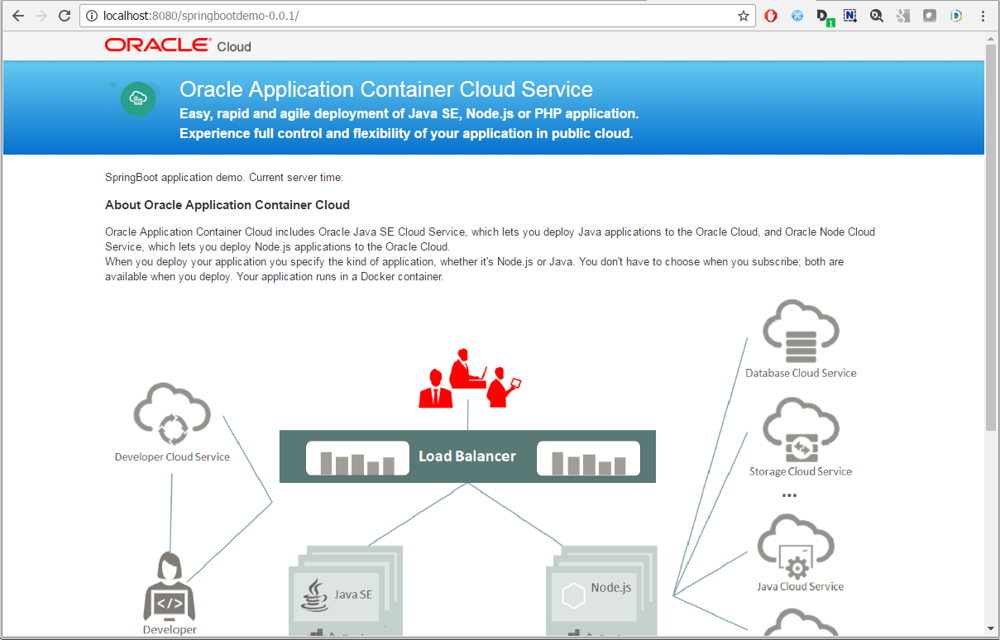

Finally stop Tomcat server - using `catalina.sh` before preparing it to deploy on Application Container Cloud Service.

	[oracle@localhost u01]$ apache-tomcat-8.5.15/bin/catalina.sh stop
	Using CATALINA_BASE:   /u01/apache-tomcat-8.5.15
	Using CATALINA_HOME:   /u01/apache-tomcat-8.5.15
	Using CATALINA_TMPDIR: /u01/apache-tomcat-8.5.15/temp
	Using JRE_HOME:        /usr/java/latest
	Using CLASSPATH:       /u01/apache-tomcat-8.5.15/bin/bootstrap.jar:/u01/apache-tomcat-8.5.15/bin/tomcat-juli.jar
	[oracle@localhost u01]$


#### Packaging Tomcat server and sample application for Application Cloud Container Service deployment ####

Once your application has been tested locally, create an archive (.zip, .tgz, .tar.gz file) that includes the application, any dependent libraries, and the `manifest.json` file. When you upload your application to Oracle Application Container Cloud Service using the user interface, you must include a file called `manifest.json` in the application archive. If you use the REST API to upload the application, this file is still required but doesn’t have to be in the archive.
The other file, `deployment.json`, is optional and is not included in the archive. You can specify the values in this file via the user interface, or you can upload the file using the REST API. In this tutorial shows the deployment using user interface.

Once you have developed your application, you need to decide how to include or reference any dependent libraries. For a Java application, you can do this by creating an uber JAR file or by using the classpath. Remember that the command used to launch your application is up to you.

You can launch directly by invoking `java` or use a shell script. The application is executed in a Linux container, so most of the rules that apply to running a command in Linux are valid. In case of our Tomcat sample the application is using a shell script. The command line for execution will be something like this:

	sh bin/catalina.sh

To create `manifest.json` use your favorite text editor (e.g. vi, gedit). The tutorial will use vi.

	[oracle@localhost u01]$ vi /u01/apache-tomcat-8.5.15/manifest.json

Press 'i' to edit file. Write or copy the the following content:
```
	{
		"runtime": {
		  "majorVersion": "8"
		},
		"command": "sh bin/catalina.sh run"
	}

	~                                                                                                                                                       
	~                                                                                                                                                       
	~                                                                                                                                                                                                                                                                                               
	~                                                                                                                                                       
	~                                                                                                                                                       
	~                                                                                                                                                       
	~                                                                                                                                                       
	~                                                                                                                                                       
	-- INSERT --
```
Use **Esc** then **Shift+Q** then write `wq` and hit Enter to save the file. This is the minimum (mandatory) version of metadata file. There are other useful properties for example: startUpTime, release, notes, etc. See [documentation](http://docs.oracle.com/cloud/latest/apaas_gs/DVCJV/GUID-D98FB882-5E58-4318-9DCB-4B404FD86E14.htm#DVCJV-GUID-D98FB882-5E58-4318-9DCB-4B404FD86E14) for further details.

Why we use `catalina.sh`? Tomcat needs to be started as a foreground process which means you cannot use `startup.sh` because that will background Tomcat and the container will exit. Instead you must use directly sh `catalina.sh run` to launch Tomcat in the foreground.

Now package the Tomcat server which is already contains the sample application war file. The package name will be **tomcat.sample.tgz**:

	[oracle@localhost u01]$ cd /apache-tomcat-8.5.15/ && tar -zcvf ../tomcat.sample.tgz * && cd ..
	bin/
	bin/version.sh
	bin/bootstrap.jar
	...
	...
	...
	work/Catalina/localhost/host-manager/
	work/Catalina/localhost/examples/
	work/Catalina/localhost/docs/

Check the result using `ls`. You have the **tomcat.sample.tgz** in folder `/u01`:

	[oracle@localhost u01]$ ls
	apache-tomcat-8.5.15/ springboot-sample/    tomcat.sample.tgz
	[oracle@localhost u01]$

#### Deploy to Application Cloud Container Service ####
The application now is ready to deploy. [Sign in](../common/sign.in.to.oracle.cloud.md) to [https://cloud.oracle.com](https://cloud.oracle.com). On the dashboard click **Instances** on Application Container Cloud Service tile to open Console.
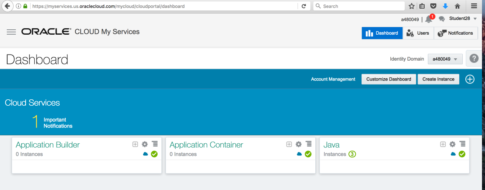

If this is the first time when you access Application Container Cloud Service console most likely the Welcome page will be displayed. In this case click **Applications** to skip usefull informations and links.
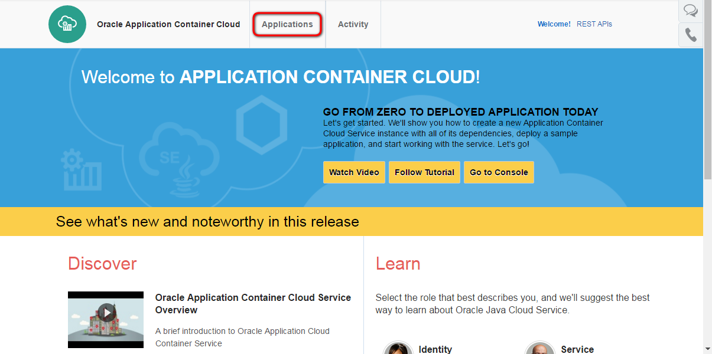

On the Application Container Cloud service console click **Create**.
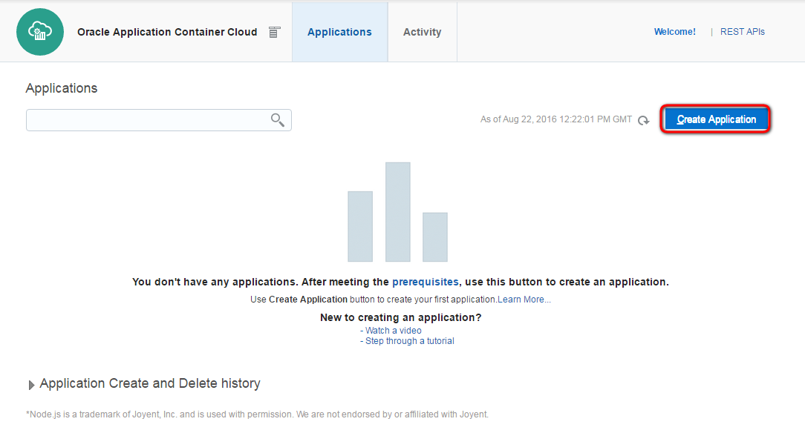

Click Java SE.
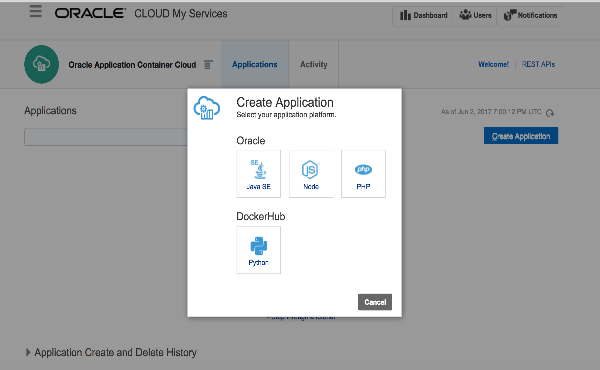

Select the region **uscom-central-1** and provide the application name following the naming standard: "student<your id>tomcat". This will be the ACCS instance name.

Upload the file `tomcat.sample.tgz` we previously created by clicking on ***Browse*** button corresponding to the Archive field. You can enter a description if you want to.

***Important:*** Leave all other fields with default values. Remember that this is a shared environment with limited capability.


Click **Create**.
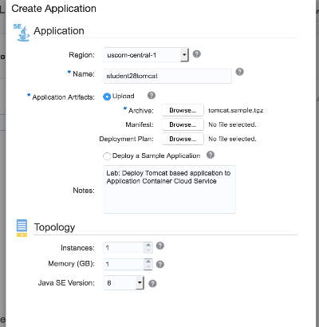

The archive file will be processed then you will be redirected back to the Application page.
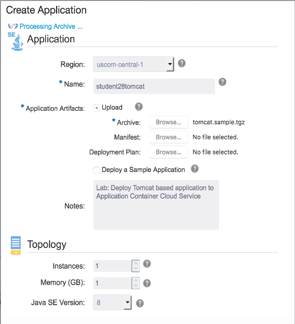

Wait until your application will be created. You can use the refresh button (above the Create Application button) to get the latest information about the progress.

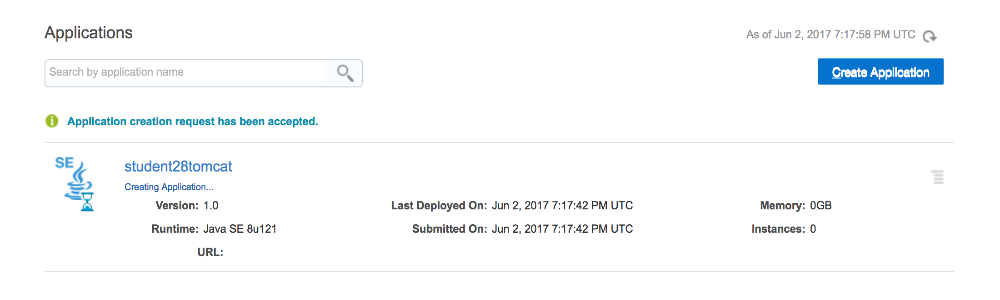

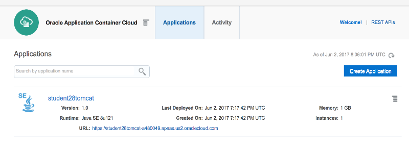

You can click on the application name to go to Details page.
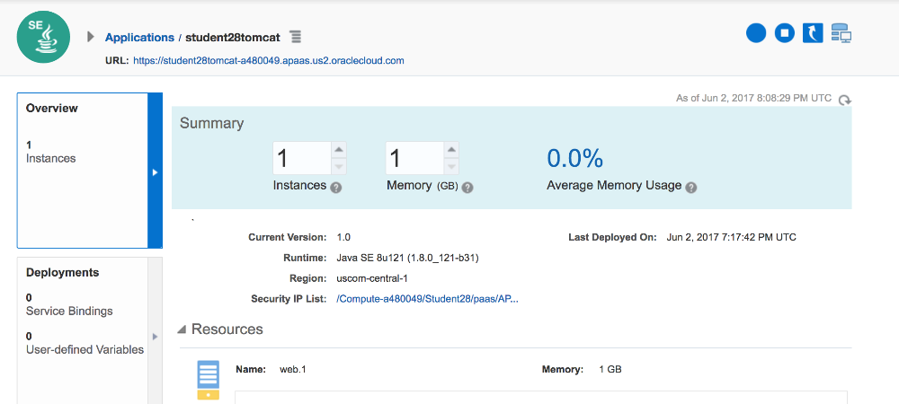

Once the provisioning is ready the application ***URL*** will be enabled and you can click to open the application.
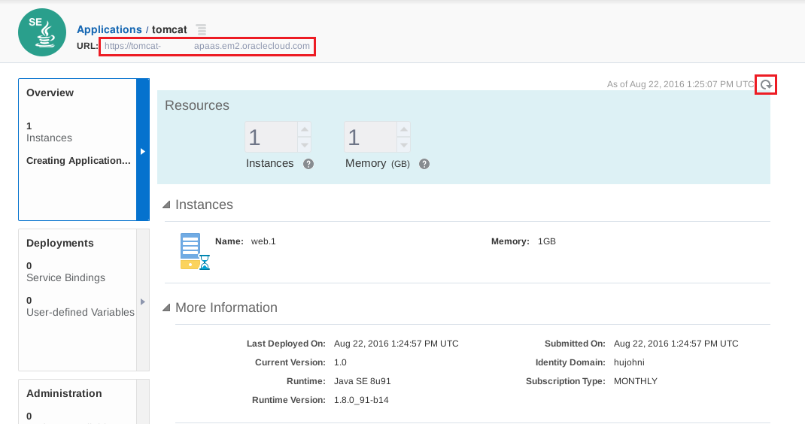

The URL goes to the default Tomcat page which already shows the server is up and running.
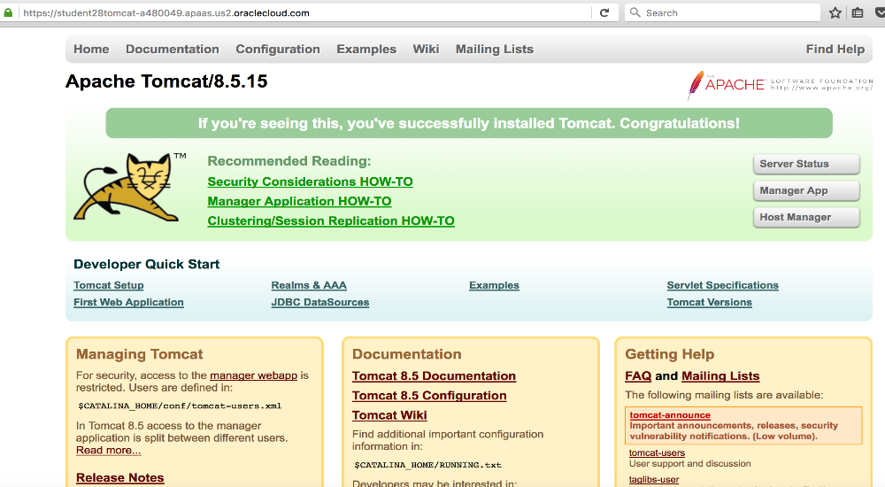

To hit the sample application append `/springbootdemo-0.0.1` at the and of the URL.
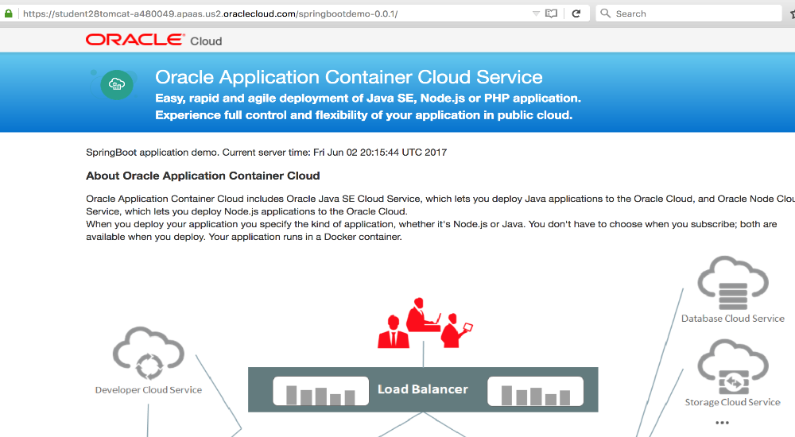

Congratulate! You have successfully deployed the SpringBoot demo application on traditional (Web Archive) way using Tomcat container.


After finish running your tests, ***remove*** your application from Application Container Cloud Service before deploying your next application.

Go back to the Applications page, click on the action menu equivalent of your application (hamburger menu) and click on `delete`. Confirm your action on the next window.
