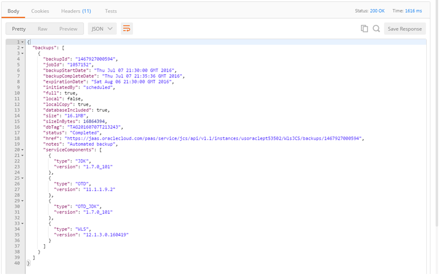

# Manage Oracle Java Cloud Service instances using REST API

## Introduction and Prerequisites

In this lab we shall see how to manage the JCS instance programmatically using REST APIs.

The Oracle Java Cloud Service REST API enables you to manage Oracle Java Cloud Service instances. This API provides an alternative to using the web-based user interface.

In this section of the Lab, we will invoke REST API against Java Cloud Service instance assigned to you. To do so you have choice of any REST tool or client you wish to use. For this lab we use "Postman".

As a prerequisite, please download and install Postman App for Chrome (you need Google Chrome on your computer) from here.

[http://www.getpostman.com/](http://www.getpostman.com/)

Once installed please start up Postman. The interface will look similar to the screenshot shown below.

A general JCS API URL looks something like this

https://_region-prefix_.oraclecloud.com/_resource-path_

For example for your instances with identity domain ex: 'usoraclept53502' the URL would  be

[https://jaas.oraclecloud.com/paas/service/jcs/api/v1.1/instances/usoraclept53502](https://jaas.oraclecloud.com/paas/service/jcs/api/v1.1/instances/usoraclept53502)

You access the Oracle Java Cloud Service REST resources over HTTPS and must provide the following information for authentication:

- .User name and password for your Oracle Java Cloud Service account.
- .Custom header, X-ID-TENANT-NAME, to specify the identity domain ID.

## View All Instances

This is a typical starting point where you list all the JCS instances in a particular cloud environment.

SYNTAX

GET https://jaas.oraclecloud.com/paas/service/jcs/api/v1.1/instances/{identityDomain}

E.g.

GET [https://jaas.oraclecloud.com/paas/service/jcs/api/v1.1/instances/usoraclept53502](https://jaas.oraclecloud.com/paas/service/jcs/api/v1.1/instances/usoraclept53502)

RESPONSE SAMPLE

## View a Service Instance

Once all the service instances have been listed we can drill down into the details of any one of the service instances since we now know the service name.

SYNTAX

GET https://jaas.oraclecloud.com/paas/service/jcs/api/v1.1/instances/{identityDomain}/{JCSINstanceName}

E.g.

GET [https://jaas.oraclecloud.com/paas/service/jcs/api/v1.1/instances/usoraclept53502/WlsJCS](https://jaas.oraclecloud.com/paas/service/jcs/api/v1.1/instances/usoraclept53502/WlsJCS)

RESPONSE SAMPLE

## View All Managed Servers

SYNTAX

GET https://jaas.oraclecloud.com/paas/service/jcs/api/v1.1/instances/{identityDomain}/{JCSINstanceName}/servers

E.g.

GET [https://jaas.oraclecloud.com/paas/service/jcs/api/v1.1/instances/usoraclept53502/WlsJCS/servers](https://jaas.oraclecloud.com/paas/service/jcs/api/v1.1/instances/usoraclept53502/WlsJCS/servers)

RESPONSE SAMPLE

## Healthcheck on a Service Instance

SYNTAX

GET https://jaas.oraclecloud.com/paas/core/api/v1.1/healthcheck/{identityDomain}/services/jaas/instances/{JCSInstanceName}

E.g.

GET [https://jaas.oraclecloud.com/paas/core/api/v1.1/healthcheck/usoraclept53502/services/jaas/instances/WlsJCS](https://jaas.oraclecloud.com/paas/core/api/v1.1/healthcheck/usoraclept53502/services/jaas/instances/WlsJCS)

RESPONSE SAMPLE

## View all Backups

SYNTAX

GET https://jaas.oraclecloud.com/paas/api/v1.1/instancemgmt/{identityDomain}/services/jaas/instances/{JCSInstanceName}/backups

E.g.

GET

https://jaas.oraclecloud.com/paas/api/v1.1/instancemgmt/usoraclept53502/services/jaas/instances/WlsJCS /backups

RESPONSE SAMPLE

## View all available Patches

SYNTAX

GET https://jaas.oraclecloud.com/paas/api/v1.1/instancemgmt/{identityDomain}/services/jaas/instances/{JCSInstanceName}/patches/available

E.g.

GET https://jaas.oraclecloud.com/paas/api/v1.1/instancemgmt/ExampleIdentityDomain/services/jaas/instances/ExampleInstance/patches/available

RESPONSE SAMPLE

For complete REST API Documentation please check this URL…

[https://docs.oracle.com/cloud/latest/jcs\_gs/JSRMR/](https://docs.oracle.com/cloud/latest/jcs_gs/JSRMR/)
