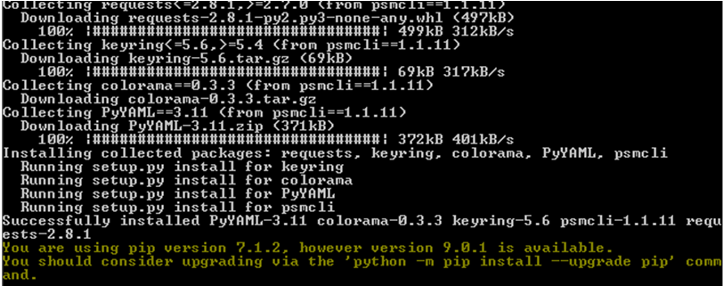
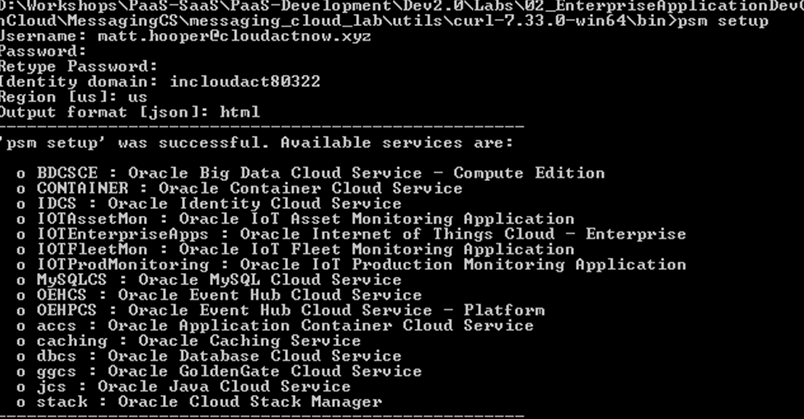
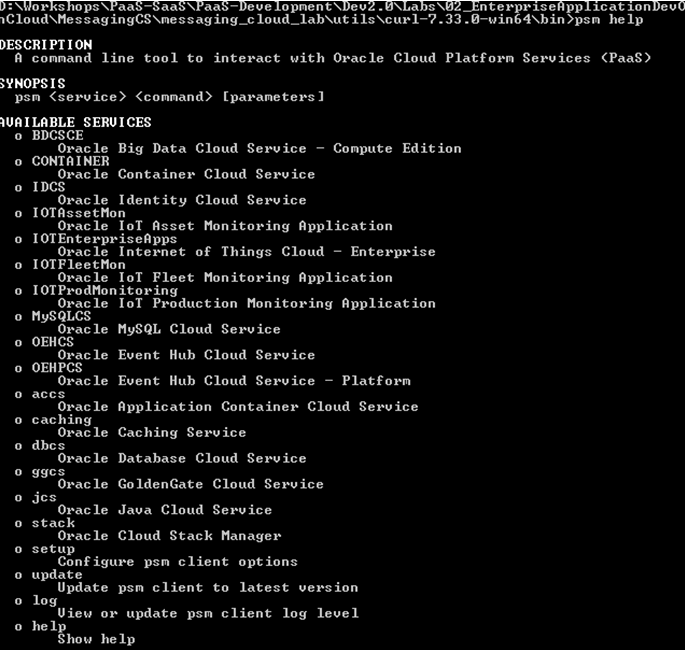

### Using the PSM (PaaS Service Manager) CLI ##

#### Background ###

Oracle PaaS Service Manager provides a command
line interface (CLI) with which you can manage the lifecycle of various
services in Oracle Public Cloud.

The CLI is a thin wrapper over PaaS REST APIs
that invokes these APIs to support common PaaS features; for example, creating
and managing instances for Oracle Java Cloud Service, Oracle Database Cloud
Service instances, and Oracle MySQL Cloud Service or creating and managing
applications with Oracle Application Container Cloud Service. The CLI also
supports Oracle Cloud Stack Manager, a PaaS tool that automates the
provisioning and deletion of cloud environments

### About this tutorial ###

This tutorial demonstrates how to perform a scale in (remove a node from cluster) activity using CLI (command-line)

For more information about PSM see the [documentation](https://docs.oracle.com/cloud/latest/jcs_gs/jcs_cli.htm).

### Prerequisites ###


 1. Perform the prerequisite tasks mentioned [here](http://docs.oracle.com/en/cloud/paas/java-cloud/pscli/performing-prerequisite-tasks-command-line-interface-1.html)
     which involves installation of below

      * cURL command-line tool
      * Python 3.3 or later


 2. JCS instance created

### Steps ###

#### Download PSM ####

You should use a REST API to download the CLI as an archive from the Oracle Cloud. In order to do it, you should first obtain your cloud account information:

  + User name and password
  + Identity domain ID


In addition to that, you need to identify your REST API server name. If you log in to your Oracle cloud account with a US data center, use `psm.us.oraclecloud.com`. Otherwise, use `psm.europe.oraclecloud.com`.

You should use `cURL` to send a request to the URL `https://_&lt;rest-server&gt;_/paas/core/api/v1.1/cli/_&lt;identitydomain&gt;_/client` and write the response to a file named `psmcli.zip`.


For example, a REST request for user studentXX on identity domain a480049:
```
curl -X GET -u studentXX:mypassword321 -H X-ID-TENANT-NAME:a480049 https://psm.us.oraclecloud.com/paas/core/api/v1.1/cli/a480049/client -o psmcli.zip

```

Note that your identity domain ID is set as part of the HTTP header X-ID-TENANT-NAME and  the URL


#### Installing the Command Line Interface ####

Install the PaaS CLI as a Python package.

Use the PIP tool (pip or pip3, depending on your installation) to install the CLI Python
package.

- On Windows:
```
&gt;**pip** install -U psmcli.zip

&gt;**pip3** install -U psmcli.zip
```
- On Linux:
```
&gt;sudo —H **pip** install -U psmcli.zip

&gt;sudo —H **pip3** install -U psmcli.zip
```


#### Configuring the Command Line Interface ####

Prior to running CLI commands, configure your connection to the
Oracle cloud.

1. Run the setup command.
```
&gt;psm setup
```
2. When prompted, enter your cloud user name, password, and identity domain.

For example:
```
Username: studentXX

Password:

Retype Password:

Identity domain: a480049
```
3.       
Enter your cloud data center region based on the REST API server that you identified earlier:

  o If your REST API server contains the text emea , enter 'emea'.

  o Otherwise accept the default value, 'us' .

For example:
```
Region [us]: emea
```
4.       
Enter your preferred output format or accept the default value:

  o  json (default)

  o  html

For example:
```
Output format [json]: json
```
After the CLI successfully connects to the Oracle cloud, it will
list the available services in this cloud account.




View the available commands for a service:

```
&gt; psm jcs help

 

DESCRIPTION

  Oracle Java Cloud Service

 

SYNOPSIS

  psm jcs &lt;command&gt; [parameters]

 

AVAILABLE
COMMANDS

  o services

       List all Oracle Java Cloud Service
instances

  o service

       List an Oracle Java Cloud Service
instance

  o create-service

       Create an Oracle Java Cloud Service
instance

  o import

       Migrate an OnPremise WLS Domain to the
Oracle Java Cloud Service instance

  o delete-service

       Delete an Oracle Java Cloud Service
instance

  o stop

       Stop an Oracle Java Cloud Service
instance, Managed Server or load balancer...

  o start

       Start an Oracle Java Cloud Service
instance, Managed Server or load...

  o restart

       Restart an Oracle Java Cloud Service
instance, Administration Server,...

  o scale-out

       Add a new Managed Server to the
specified cluster to scale-out the Oracle...

  o scale-in

       Remove a Managed Server to scale-in the
Oracle Java Cloud Service instance...

  o scale-up

       Scale the specified Administration
Server or Managed Server node on an...

  o scale-down

       Scale the specified Administration
Server or Managed Server node on an...

  o view-backup-config

       List backup configuration of an Oracle
Java Cloud Service instance

  o update-backup-config

       Update backup configuration of an Oracle
Java Cloud Service instance

  o view-backups

       List all backups of an Oracle Java Cloud
Service instance

  o view-backup

       List a backup of an Oracle Java Cloud
Service instance

  o backup

       Initiate an on-demand backup for an
Oracle Java Cloud Service instance

  o delete-backup

       Delete a backup of an Oracle Java Cloud
Service instance

  o view-restores

       List all restore operations for an
Oracle Java Cloud Service instance

  o view-restore

       List a specified restore operation for
an Oracle Java Cloud Service instance.

  o restore

       Restore an Oracle Java Cloud Service
instance from the specified backup....

  o available-patches

       List all available patches for an Oracle
Java Cloud Service instance

  o applied-patches

       List all applied patches for an Oracle
Java Cloud Service instance

  o precheck-patch

       Precheck to identify potential issues
that might prevent the specified...

  o patch

       Apply a patch to an Oracle Java Cloud
Service instance

  o rollback

       Roll back a patch for an Oracle Java
Cloud Service instance

  o operation-status

       View status of an Oracle Java Cloud
Service instance operation

  o access-rules

       List access rules for Oracle Java Cloud
Service instance

  o create-access-rule

       Create an access rule for Oracle Java
Cloud Service instance

  o delete-access-rule

       Delete an access rule for Oracle Java
Cloud Service instance

  o enable-access-rule

       Enable an access rule for Oracle Java
Cloud Service instance

  o disable-access-rule

       Disable an access rule for Oracle Java
Cloud Service instance

  o help

       Show help

```

View the available parameters for a specific
command along with examples.

```
&gt; psm jcs create-service help

 

DESCRIPTION

  Create an Oracle Java Cloud Service instance

 

SYNOPSIS

  psm jcs create-service [parameters]

       -c, --config-payload &lt;value&gt;

       [-of, --output-format &lt;value&gt;]

 

AVAILABLE
PARAMETERS

  -c, --config-payload    (file)

       Path to JSON file containing Oracle Java
Cloud Service provisioning

       configuration parameters

 

  -of, --output-format    (string)

       Desired output format. Valid values are
[json, html]

 

EXAMPLES

  psm jcs create-service -c
/home/templates/create-jcs-service.json

 

[oracle@localhost Desktop]$

```
**Use the Command Line Interface**

First list the Java Cloud Services in the configured identity domain:

```
&gt; psm jcs services
```

```

{

   
"uri":"https://psm.us.oraclecloud.com/paas/service/jcs/api/v1.1/instances/in

cloudact80322",

    "service_type":"jaas",

   
"implementation_version":"1.0",

    "services":[

        {

           
"service_name":"MyJCS",

           
"version":"12cRelease212",

           
"wlsVersion":"12.2.1.2.0",

           
"status":"Running",

           
"error_status_desc":"",

            "compliance_status":"",

           
"compliance_status_desc":"",

           
"auto_update":"true",

           
"description":"MyJCS",

           
"identity_domain":"incloudact80322",

           
"creation_time":"2017-02-13T20:55:48.836+0000",

            "last_modified_time":"2017-02-15T18:42:53.445+0000",

           
"created_by":"matt.hooper@cloudactnow.xyz",

           
"service_uri":"https://psm.us.oraclecloud.com/paas/service/jcs/api/v

1.1/instances/incloudact80322/MyJCS"

        }

    ]

}
```
To get more details about specific service use
psm service -s servicename command:

```
&gt; psm jcs service -s MyJCS
```

```
{

    "service_name":"MyJCS",

   
"version":"12cRelease212",

   
"wlsVersion":"12.2.1.2.0",

    "status":"Running",

    "error_status_desc":"",

    "compliance_status":"",

   
"compliance_status_desc":"",

    "auto_update":"true",

    "description":"MyJCS",

   
"identity_domain":"incloudact80322",

   
"creation_time":"2017-02-13T20:55:48.836+0000",

   
"last_modified_time":"2017-02-15T18:42:53.445+0000",

    "created_by":"matt.hooper@cloudactnow.xyz",

   
"service_uri":"https://psm.us.oraclecloud.com/paas/service/jcs/api/v1.1/inst

ances/incloudact80322/MyJCS",

   
"domain_name":"MyJCS_domain",

   
"domain_mode":"PRODUCTION",

   
"cluster_name":"MyJCS_cluster",

    "num_nodes":3,

    "level":"PAAS",

   
"subscription_type":"MONTHLY",

    "edition":"EE",

    "shape":"oc3",

   
"otd_provisioned":"yes",

   
"loadbalancer_configured":"no",

   
"identity_service":"no",

    "otd_shape":"oc3",

    "otd_storage_size":50176,

    "ocpu_count":3,

    "memory_size":22.5,

    "storage_size":175,

    "service_components":[

        {

            "type":"WLS",

           
"version":"12.2.1.2.0"

        },

        {

           
"type":"OTD_JDK",

           
"version":"1.8.0_112"

       
},

        {

            "type":"OTD",

           
"version":"12.2.1.2.0"

        },

        {

            "type":"JDK",

           
"version":"1.8.0_112"

        }

    ],

   
"creation_job_id":"9584422",

    "deletion_job_id":0,

    "db_info":"//MyDBCS:1521/PDB1.incloudact80322.oraclecloud.internal",

   
"db_service_name":"MyDBCS",

   
"db_service_uri":"https://psm.us.oraclecloud.com/paas/service/dbcs/api/v1.1/

instances/incloudact80322/MyDBCS",

    "useStackTag":"false",

    "num_ip_reservations":3,

   
"wls_admin_url":"https://129.144.151.193:7002/console",

   
"fmw_control_url":"https://129.144.151.193:7002/em",

   
"otd_admin_url":"https://129.144.151.78:8989/em",

   
"sample_app_url":"https://129.144.151.78/sample-app/",

    "secure_content_url":"https://129.144.151.78",

   
"wls_deployment_channel_port":9001,

   
"psm_plugin_version":"17.1.3-537",

   
"compute_site_name":"US006_Z52",

    "db_associations":[

        {

           
"db_service_name":"MyDBCS",

            "db_infra":true,

            "db_app":false,

           
"db_connect_string":"//MyDBCS:1521/PDB1.incloudact80322.oraclecloud.

internal",

           
"pdb_service_name":"PDB1",

           
"db_version":"12.1.0.2",

           
"db_em_url":"https://129.144.151.134:5500/em",

            "db_apex_url":"https://129.144.151.134/apex/pdb1/",

           
"db_monitor_url":"https://129.144.151.134/dbaas_monitor",

           
"db_service_level":"PAAS"

        }

    ]

}

```


